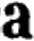
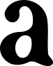

# Dessin de la typographie à partir des scans des glyphs :

## extraction
Les images des glyphes sont extraites avec le script */Toolbox/extract-images-from-PAGE.py* :
```
python Toolbox/extract-images-from-PAGE.py {folderInputXMLs} {folderInputImgs} {folderOutputPath}
python Toolbox/extract-images-from-PAGE.py /Layout/T2P-layout-glyphs /Pages /Glyphes/extractionAutomatique
```
elles sont enregistrées sous la forme :
`{char}{numéro}.png`

## tri
puis triées par le script */Toolbox/sort-image-of-char.py* (script pas encore commenté)
```
python Toolbox/sort-image-of-char.py {rootFolder} #fichier où sont les images pas encore triées
```
le script va :
* trier les images à la racines, celles qui ne sont pas triées. Il indentifie le caractère de l'image par le premier élément de sont titre. Il crée un dossier pour ce caractère si il n'existe pas encore. Il déplace l'image dans le dossier corespondant.
* retrier les images en parcourant les fichiers de tri pour repérer les images dont le nom ne corespond pas au fichier dans lequel elle est. Renommer ces images pour quelles corespondent au dossier dans lequel elles sont.

Il faut donc lancer une première fois le script pour trier automatiquement les images. Puis vérifier à la main si une image ne corespond pas au dossier où elle est, la déplacer dans le fichier où elle devrait être. Relancer le script pour mettre a jour leur nom.

*attention le script ne duplique pas le fichier originel, il travail directement dans le rootFolder*
## moyenne
Créer un caractère qui soit représentatif de l'ensemble des glyphes de l'extrait pour gommer et intégrer les erreurs d'impression. Faire la "moyenne" de toutes les glyphes, c'est-à-dire superposer toutes les images du caractère en réduissant leurs oppacités. On utilise pour cela la fonction `convert` de  [ImageMagick](https://www.imagemagick.org/script/index.php)
```sh
convert {images} -average average.png
```

Automatisé dans le script : *Toolbox/average-with-ImageMagick.py*
```sh
python Toolbox/average-with-ImageMagick.py {folders2averages}
python Toolbox/average-with-ImageMagick.py Glyphes/extractionAutomatique2-sorted/a Glyphes/extractionAutomatique2-sorted/b Glyphes/extractionAutomatique2-sorted/c {...}
```


## contraste de l'image et largeur de la glyphe
A partir de cette image moyenne, avant de la vectoriser, il faut augmenter ses contrastes.
Les contours flou de cette forme permettent déjà de choisir l'épaisseur des glyphes. Avec [gimp](gimp), on augmente la résolution de l'image puis on utilise l'outil **Niveaux**.

avant:

après:


`120 + 130 / 2 = 125` <-- numéro du niveau


[Un point sur les épaisseurs de typographie](http://bigelowandholmes.typepad.com/bigelow-holmes/2015/07/on-font-weight.html)

ou alors avec [ImageMagick](https://www.imagemagick.org/Usage/color_mods/#level) :
```
convert {imgSource} -level {mini},{max} {imgOutput}
convert Glyphes/clean/a100.png -level 45%,55% Glyphes/clean/a100-50pc.png #45% + 55% / 2 = 50pc <-- pourcentage du niveau
# faire des testes avec des "deltas" différents (55%-45%=10% <- delta du niveau) pour comparer le résulats de la vectorisation.
```
delta = 10% --->    <--- delta = 3%
## vectorisation
avec Inkscape en mode GUI ou ligne de commande, ou directement avec [Potrace](http://potrace.sourceforge.net/) puis retouche et simplification du tracé avec inkscape.
### Simplification du tracé :

