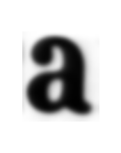

# Dessin de la typographie à partir des scans des glyphs :

## extraction

Les images des glyphes sont extraites avec le script */Toolbox/extract-images-from-PAGE.py* :
```
python Toolbox/extract-images-from-PAGE.py {folderInputXMLs} {folderInputImgs} {folderOutputPath}
python Toolbox/extract-images-from-PAGE.py /Layout/T2P-layout-glyphs /Pages /Glyphes/extractionAutomatique
```
elles sont enregistrées sous la forme :
`{char}{numéro}.png`


## tri

puis triées par le script */Toolbox/sort-image-of-char.py* (script pas encore commenté)
```
python Toolbox/sort-image-of-char.py {rootFolder} #fichier où sont les images pas encore triées
```
le script va :
* trier les images à la racines, celles qui ne sont pas triées. Il indentifie le caractère de l'image par le premier élément de sont titre. Il crée un dossier pour ce caractère si il n'existe pas encore. Il déplace l'image dans le dossier corespondant.
* retrier les images en parcourant les fichiers de tri pour repérer les images dont le nom ne corespond pas au fichier dans lequel elle est. Renommer ces images pour quelles corespondent au dossier dans lequel elles sont.

Il faut donc lancer une première fois le script pour trier automatiquement les images. Puis vérifier à la main si une image ne corespond pas au dossier où elle est, la déplacer dans le fichier où elle devrait être. Relancer le script pour mettre a jour leur nom. Il faut aussi séparer les glyphes d'un autre style de charactère (italique,gras...).
*TODO : vérifier que ces sous-dossiers de style de charactère ne pose pas de problème au script*
*attention le script ne duplique pas le fichier originel, il travail directement dans le rootFolder*

## moyenne

Créer un caractère qui soit représentatif de l'ensemble des glyphes de l'extrait pour gommer et intégrer les erreurs d'impression. Faire la "moyenne" de toutes les glyphes, c'est-à-dire superposer toutes les images du caractère en réduissant leurs oppacités. On utilise pour cela la fonction `convert` de  [ImageMagick](https://www.imagemagick.org/script/index.php)
```sh
convert {images} -average average.png
```

Automatisé dans le script : *Toolbox/average-with-ImageMagick.py*
```sh
python Toolbox/average-with-ImageMagick.py {folders2averages}
python Toolbox/average-with-ImageMagick.py Glyphes/extractionAutomatique2-sorted/a Glyphes/extractionAutomatique2-sorted/b Glyphes/extractionAutomatique2-sorted/c {...}
```


## contraste de l'image et largeur de la glyphe

A partir de cette image moyenne, avant de la vectoriser, il faut augmenter ses contrastes.
Les contours flou de cette forme permettent déjà de choisir l'épaisseur des glyphes. Avec [gimp](gimp), on augmente la résolution de l'image puis on utilise l'outil **Niveaux**.

avant:

après:


`120 + 130 / 2 = 125` <-- numéro du niveau


[Un point sur les épaisseurs de typographie](http://bigelowandholmes.typepad.com/bigelow-holmes/2015/07/on-font-weight.html)

ou alors avec [ImageMagick](https://www.imagemagick.org/Usage/color_mods/#level) :
```
convert {imgSource} -level {mini},{max} {imgOutput}
convert Glyphes/clean/a100.png -level 45%,55% Glyphes/clean/a100-50pc.png #45% + 55% / 2 = 50pc <-- pourcentage du niveau
# faire des testes avec des "deltas" différents (55%-45%=10% <- delta du niveau) pour comparer le résulats de la vectorisation.
```
avec le script *Toolbox/levels-by-letter.py*
```
python Toolbox/levels-by-letter.py {Glyphes/average/average.png} 10 20 30 40 50 60 70 80 90
```

delta = 10% --->    <--- delta = 3%

*la préparation des bitmap peut-être réalisée aussi avec [mkbitmap](http://potrace.sourceforge.net/mkbitmap.html)*



## vectorisation
avec Inkscape en mode GUI ou ligne de commande, ou directement avec [Potrace](http://potrace.sourceforge.net/) puis retouche et simplification du tracé avec inkscape.
```
inkscape -f clean/a100.png --select image10 --verb SelectionTrace #ouvre l'interface graphique d'inkscape directement avec l'outil de vectorisation ouvert
potrace clean/a100.bmp -s -o test.svg #vectorisation en ligne de commande (voir man potrace)
```
`potrace clean/a100.bmp -s -o -a test2.svg` `potrace a100.bmp -s --opttolerance 1 -o test4.svg`  `potrace a100.bmp -s --opttolerance 2 -o test5.svg` 

### Qualité du SVG.
Avec potrace le path est enfant d'une balise "g" avec une grosse transformation. Les coordonnées des points du path sont arrondies après la virgules ! Avec inkscape aussi les tracés sont "optimisés" (mélange de coordonnées relatives et absolues). Pour les passer en absolues :
> 'Edit> preferences > SVG Output > Path Data' to always use absolute coordinates (i.e. do not allow relative coordinates). This will only affect newly created paths, or existing objects for which a rewrite of the path data is triggered.
  For existing paths, use 'Edit > Select All in All Layers', and nudge the selection with the arrow keys (e.g. one step up and one back down again). This will trigger a rewrite of the path data in 'd' which will follow the changed preferences for optimized path data. resave.

### Visionner les tracés :
Visionneuse de tracés, points et poignées : */Glyphes/vectors/index.html* (to do: corriger le décalage entre les handles d'un point à un autre/OK-25-01-17/ mais il reste des problèmes pour les derniers points, après un segClosePath)

### Simplification du tracé :
simplification réalisée avec inkscape

(to do : faire un script qui simplifi et sauvegarde le tracé une 30ene de fois et qui génère le html pour la visioneuse.)


## le o et le n


trust your eyes : 30% de niveaux
